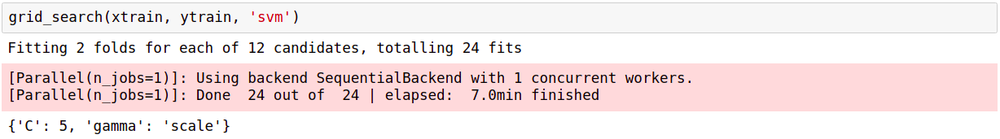
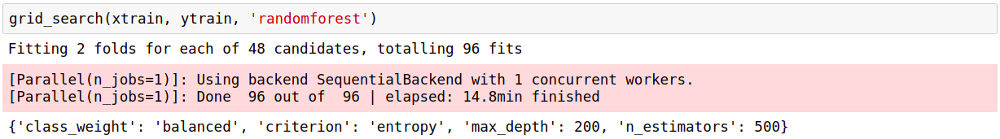
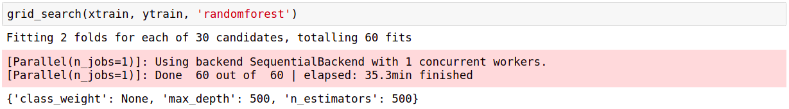

# Human Activity Recognition

## Overview  

This project implements machine learning classification of accelerometers data on the belt, forearm, arm, and dumbbell of 6 participants to predict the manner in which people perform the exercise.  

## Background  

Human Activity Recognition (HAR) has been recognized as a key research area and is gaining attention by the computing research community, especially for the development of context-aware systems. There are many potential applications for HAR, like: elderly monitoring, life log systems for monitoring energy expenditure and for supporting weight-loss programs, and digital assistants for weight lifting exercises.

## Data Exploration

I use `pandas` to deal with data in the `.csv` file. There are total 160 categories (features) but some are useless, such as `raw_timestamp_part_1`, `new_window`, and so on. Hence, I drop those features and use the remaining 52 features to train the model. Also, since there are no labels in the testing data, I split the training data into training set (75%) and validation set (25%), and perform cross validation (5-folds) to compute the accuracy. The details of prepocessing is available at [utils.py](src/utils.py).

## Prediction Modeling

At first, I try to use the **SVM** model with RBF kernel but it does not work perfectly. Then, I turn to **Random Forest Classifier** and it has much better performance. As for the hyperparameters, I use grid search in order to achieve the best performance.

* SVM    
    * `kernel`: 'rbf'
    * `C`: 5
    * `gamma`: 'scale'
    * Tuning:
      * `C`: [1, 2, 5, 10]
      * `gamma`: ['scale', 'auto']
        

* Random Forest Classifier  
  * `n_estimator`: 500
  * `max_depth`: 500
  * `class_weight`: 'balanced'
  * Tuning 1:  
    * `n_estimators`: [10, 100, 200, 500]
    * `max_depth`: [200, 500, None]
    * `criterion`: ['gini', 'entropy']
    * `class_weight`: ['balanced', None]  
      
  * Tuning 2:  
    * `n_estimators`: [500, 1000, 2000]
    * `max_depth`: [250, 500, 750, 1000, None]
    * `class_weight`: ['balanced', None]  
      
  * **Note**: It is reasonable that the more `n_estimatros` and `max_depth`, the higher the accuracy.

**Note**: Both have 25% validation set and do 5-folds cross validation.

## Model Application

The following are the results of 2 models. Please read the jupyter notebook ([here](https://bit.ly/viewipynb-LYCheng-HumanActivityRecognition)) for more details.

* SVM  
  * accuracy: **93.31%**  
  * prediction: ['B', 'A', 'B', 'A', 'A', 'E', 'D', 'B', 'A', 'A', 'B', 'C', 'B', 'A', 'E', 'E', 'A', 'B', 'B', 'B']

* Random Forest Classifier  
  * accuracy: **99.69%**  
  * prediction: ['B', 'A', 'B', 'A', 'A', 'E', 'D', 'B', 'A', 'A', 'B', 'C', 'B', 'A', 'E', 'E', 'A', 'B', 'B', 'B']

As we can see, both models predict the same result and I believe they are good enough for this problem. The performance of **Random Forest Classifier** is better than **SVM** and it classifies almost correctly on the validation set. Besides, **Random Forest Classifier** takes less time to train the model so it is more effiecient.

## Testing Environment

* sysname: `Linux`  
* release: `4.15.0-45-generic`  
* machine: `x86_64`  
* python: `3.6.7` and `3.7.1`

## Required package

* `scikit-learn`